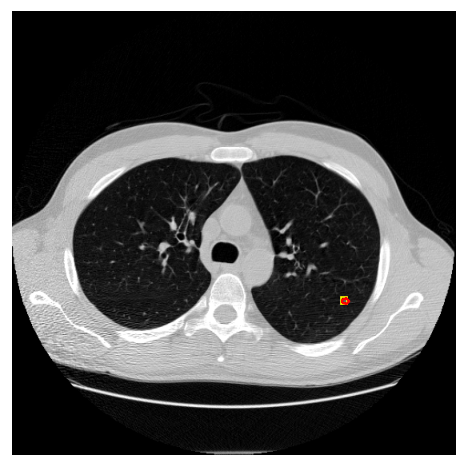
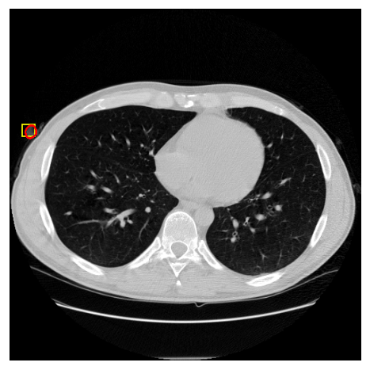

# oncoct

An LLM agent that reads a chest CT, finds lung nodules, measures them, scores them, and
writes a structured report. **Every number in that report traces back to a tool the agent
called.** It cannot make one up, and that is enforced by code, not by a prompt.

> Research and decision support only. Not a medical device. Every finding is a candidate that
> needs a radiologist. See `plan.md` for the full writeup.

## Results

| Stage | Metric | Result |
|-------|--------|--------|
| Detection | FROC / CPM, LUNA16 subset0, 89 scans | **0.7755** (CI 0.66 to 0.87) |
| Segmentation | Dice vs LIDC contours, n=15 | **0.70** mean |
| Malignancy | AUROC, patient-grouped 5-fold CV, n=1353 | **0.876 ± 0.045** |
| Agent | full study on real CT | **5 lesions, 24 tool calls, 0 untraced numbers** |

The detection number was measured twice in separate runs and came back identical to four
decimals. It is out of fold. The malignancy classifier ties a plain logistic regression on the
same features, which is stated in `plan.md` rather than hidden.

## What it produced

One LUNA16 scan, analysed end to end. The agent picked the order of operations, made 24 tool
calls, and wrote the impression itself.

| | |
|---|---|
|  |  |
| **L1**: 5.67 mm, 113.09 mm3, lung / upper lobe left, malignancy 0.0002 | **L2**: 14.15 mm, attributed to background, flagged `outside_lung_parenchyma` |

The second one is the interesting case. The detector was confident about it, score 0.87 at a
0.5 threshold. Organ attribution then found the mask overlapped no segmented structure at all,
so it resolved to `background` and `outside_lung_parenchyma` fired. It reached the report as a
candidate needing review rather than as a 14 mm lung nodule. A detector on its own would have
reported it; the independent organ check is what caught it.

The agent's own closing line:

> "Chest CT analysis revealed 5 nodular candidate findings. Lesion L1 (5.67 mm long axis,
> volume 113.09 mm3 in left upper lobe) shows a malignancy score of 0.0002. ... All lesions
> are candidates requiring radiologist review."

All 16 numbers in it come from recorded tool calls. The report and its trace are in
`results/agent/`.

## How the guarantee works

Three mechanisms, all tested:

1. **Tools talk in handles, not values.** They reference each other by `study_uid`,
   `detection_id`, `lesion_id`. A measurement never appears as a tool argument, so there is no
   route by which the model could retype or invent one.
2. **The report is built from the trace.** The agent supplies a lesion list and prose, nothing
   numeric. Each field is filled from tool output and tagged with the call that produced it.
3. **The prose is checked.** Every number in the impression must match something a tool
   returned. Rounded restatements pass (8.4 for 8.43), percentages pass (73% for 0.73), a
   fabricated figure fails the run and no report is written.

## Pipeline

```
LUNA16 .mhd -> resample, HU preserved
          -> TotalSegmentator (organ map)
          -> MONAI RetinaNet (nodule boxes)
          -> MedSAM2 (box to 3D mask, isolated env via subprocess worker)
          -> RECIST 1.1 measurement and volume
          -> organ attribution by mask overlap
          -> malignancy classifier
          -> LLM agent: structured report plus trace
```

Only the malignancy head is trained. Everything else is pretrained inference. Input is the
LUNA16 MetaImage format; DICOM series conversion is not implemented. VISTA3D is wired as the
Apache licensed fallback but its `segment()` still raises, so MedSAM2 is the only working
segmenter. Both are listed under limitations in `plan.md`.

## Running it

```bash
conda env create -f environment.yml && conda activate oncoct
pip install -e .

pytest                                   # 61 tests, no GPU or API key needed

# deterministic run
python scripts/run_pipeline.py --series <scan.mhd> --out results

# agent-driven run (set GEMINI_API_KEY or ANTHROPIC_API_KEY)
python scripts/run_agent.py --series <scan.mhd> --out results
```

The agent works with either provider. `src/oncoct/agent/gemini_client.py` is the whole cost of
supporting a second one, because the loop only needs a client with `.messages.create()`.

## Layout

```
src/oncoct/      io, context, detect, segment, measure, classify, labels, report, agent
eval/            LUNA16 FROC (official script, ported), Dice
scripts/         run_pipeline, run_agent, training and eval scripts
tests/           coordinates, RECIST, quality flags, traceability, agent loop
configs/         pipeline.yaml, agent_prompt.md
results/agent/   the agent's report and its tool call trace
```

## Data and licences

| Dataset | Use | Licence |
|---------|-----|---------|
| LUNA16 | detection and FROC | CC BY 4.0 |
| LIDC-IDRI | malignancy labels via pylidc | CC BY 3.0 |

Code is Apache-2.0. Built on TotalSegmentator, MONAI, MedSAM2 and nnU-Net, each under its own
licence. MedSAM2 weights are research and education only, which is why VISTA3D (Apache-2.0) is
wired as the intended open fallback. That fallback is not implemented yet, so today the only
working segmenter carries the research-only weight licence.
